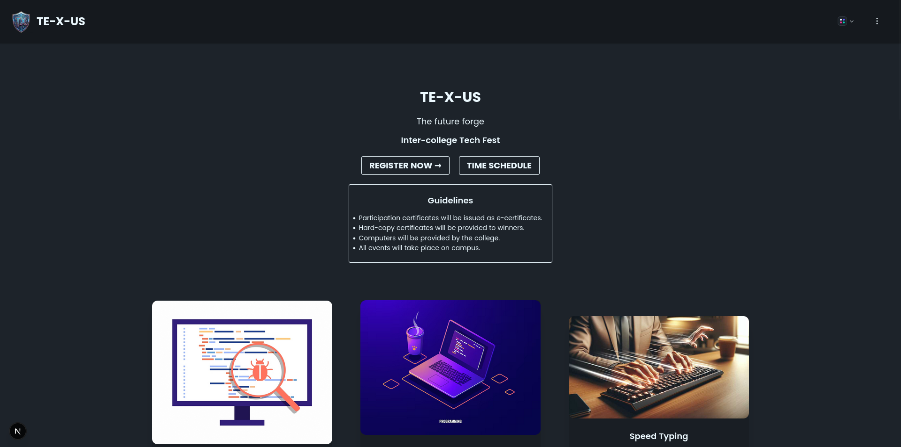
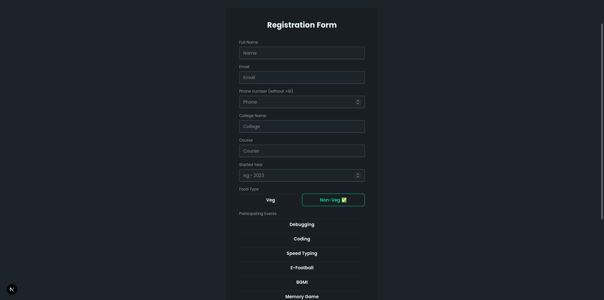
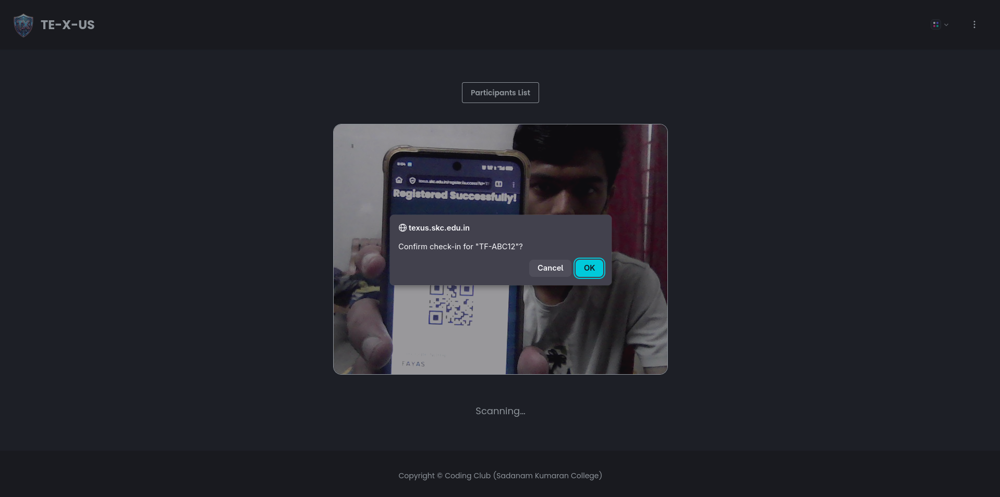
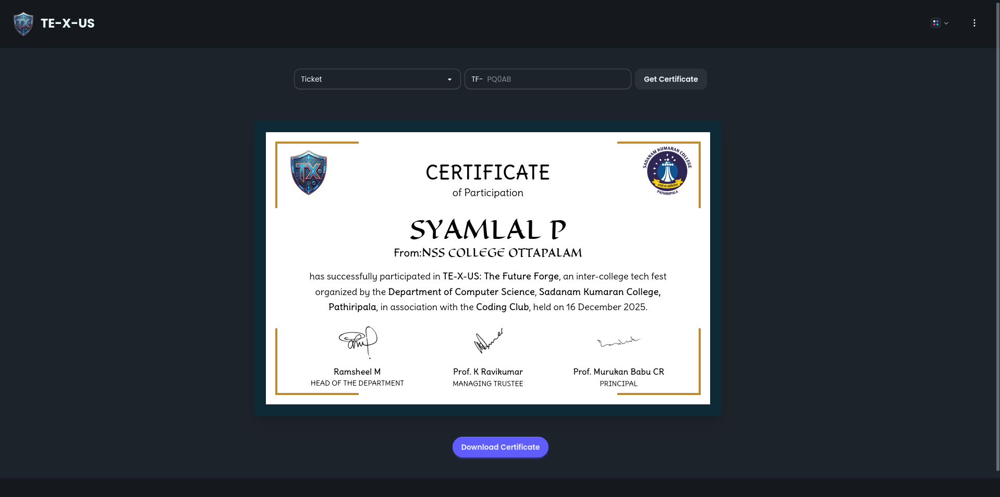

# Fest Management Website

A comprehensive web application for managing fest registrations, ticketing, and participant verification, built with Next.js, Tailwind CSS, and MongoDB.

---

## Features

- Participant registration
- Auto-generated tickets with QR codes
- Secure admin panel
- QR-based check-in system
- Dynamic e-certificates for verified participants

---

## Technologies Used

- Next.js (framework)
- Tailwind CSS with DaisyUI (styling)
- MongoDB (database)
- Node.js (server-side logic)

---

## Getting Started

To get a local copy of the project up and running, follow these steps:

1. Clone the repository:
   ```bash
   git clone https://github.com/fayasnoushad/fest-management-website.git
   cd fest-management-website
   ```
2. Install dependencies:
   ```bash
   pnpm install
   ```
3. Set up environment variables:
   Create a `.env` file in the root directory and add the following variables:
   ```env
   MONGODB_URI=your_mongodb_connection_string
   PASSWORD=your_admin_password
   ```
4. Run the development server:
   ```bash
   pnpm dev
   ```
5. Open your browser and navigate to `http://localhost:3000` to view the application.

6. Access the admin panel at `http://localhost:3000/admin` using the password set in the `.env` file.

---

## Contributing

Contributions are welcome! Please fork the repository and create a pull request with your changes.

---

## License

This project is licensed under GNU General Public License v3.0. See the [LICENSE](LICENSE) file for details.

---

## Screenshots

<div align="center">
    
    
    
    
</div>

Note: The e-certificate shown in this post is a sample, shared with permission from the respective participant.

---
